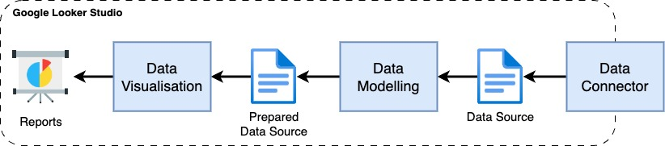

# Google Looker Studio exercise

This readme contains an introduction to Google Looker Studio, a section on how to set it up and instructions to a real-life exercise on self service analytics based on a lego dataset from the current [maven data challenge](https://mavenanalytics.io/data-playground) 

## About Google Looker Studio

Google looker Studios simple control, flexibility and simplicity sets the software apart from more popular competitors like PowerBI or Tableau. 
It's simplicity is achived by concentrating on fewer features while being able to deliver results faster, which makes it a great platform to do a quick exercise. 

### history
- 2016: Release as Google Data Studio
- 2020: Google acquired and acquisitioned the data analytics company Looker
- 2022: Fusion of Google Data Studio and Looker
- 2022: Annoncment at [Cloud Next](https://cloud.google.com/blog/topics/google-cloud-next/google-cloud-next22-wrap-up): Looker is set to become the name for all Google Cloud Business intelligence products.

### key features
**An easy-to-use web interface:** Looker Studio is designed to be intuitive and easy to use. 
The report editor features simple drag-and-drop objects with fully custom property panels on a snap-to-grid canvas.

**Report templates:** With a robust library of report templates to choose from, you can visualize your data in minutes.
Connect data sources and customize the design to meet your needs.

**Data connectors:** Data sources act as pipes to connect a Looker Studio report to underlying data. 
Each source has a unique, prebuilt connector to ensure your data is easy to access and use. There are 24 Google owned connectors currently and more than 850 connectors by official google looker studio partners. You can develop your own connectors as well.

**Report embedding:** Embedding allows you to include your Looker Studio report in any web page or intranet, making it easier for you to publish your results.

**Looker Studio API:** The Looker Studio API allows a seamlessly integration within the Google Platform to quickly automated and set up Looker Studio with applications.

### payment model
The basic version is available at no charge for creators and report viewers alike, while the pro version includes department level business intelligence with Google Cloud support and additional system administration. 
This makes the basic version nearly feature complete to the pro version, when it comes to self service analytics.

### Further mention
The downside with Looker Studio is that you can't create huge reports, since we are relying on limited computing power that google provides us.
In case of performance issues, the data will either have to be prepared differently beforehand, or you will have to use other third party tools. 

An insightfull blog article about this issue and how to handle it can be found [here](https://blog.coupler.io/why-is-looker-studio-slow/).
For the exercises in this repository the provided computing power by google should suffice.

## Setup Google Looker Studio

- Create a google account at https://accounts.google.com/signup.
- Go to https://lookerstudio.google.com/ and log in with your google account. 
- Accept the terms of service.

## exercise

This exercise serves as a first hand experience with self service analytics using Google Looker Studio.

### Motivation

Lego is more popular than ever, reaching record profits and marketshares unrivaled by any competitor.
During the crisis, Lego discovered a new type of customer: young men. They provide a new steady source of income. ([reference](https://www.zeit.de/zeit-magazin/leben/2023-12/lego-popularitaet-spielzeug-videospiele))

With the new [maven data challenge](https://mavenanalytics.io/data-playground) that includes all lego sets released by lego from up to 1970, we can take a closer look on how this new market trend changed legos product portfolio over the years.

### Overview

The exercise overview can be depicted as such:

a data source will be created by the data connector. 
The data will then be adjusted inside a data modelling layer. 
The prepared data is than visualised as a report.

### Sections

The exercise is divided into two sections within their respective folders that should be completed in succession, since they depend on each other:
- `./1_data_setup`: covers the creation of a data source and basic data modelling.
- `./2_report_creation`: covers the creation of a report with different diagram and control types while additionally trying to answer a few questions about the underlying data.

Instructions are located in the `./<section>/readme.md`.

Each section also includes a `./<section>/solution` folder, which contains hints that can help you get to the solution and public links to shared google resources that represent a possible solution to each exercise.
